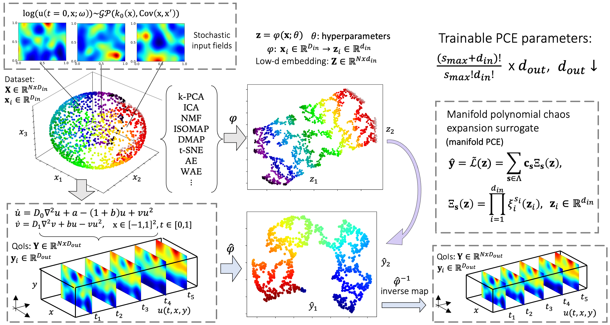
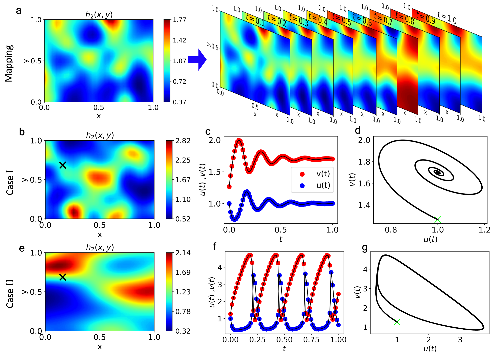

## Table of contents
* [General info](#general-info)
* [Methods](#methods)
* [Application](#application)
* [Contents](#contents)
* [Datasets](#datasets)
* [Clone](#clone)

## General info

This Git repository contains codes for the **'On the influence of over-parameterization in manifold based surrogates and deep neural operators'** paper which can be found here: [https://arxiv.org/abs/2203.05071](https://arxiv.org/abs/2203.05071).

## Methods

* **Manifold PCE** or **mPCE** approximates mappings via the identification of low-dimensional embeddings of input and output functions and the construction of a polynomial-based surrogate.

<p align="center">
  
</p>

* **DeepONet** is a deep neural operator model which allows the construction of mapping between infinite dimensional functions via the use of deep neural networks (DNNs).

<p align="center">
  
</p>

## Application

* The **Brusselator** diffusion-reaction dynamical system is studied, which describes an autocatalytic chemical reaction between two substances. 
* The objective is to approximate the mapping between high-dimensional stochastic initial fields with the evolution of the system across time and space (first row below). The model response is learned for two dynamical states, when the system reaches a **fixed point** in the phase space (second row) and when it reaches a **limit cycle** (third row). 
* We explore the capabilities of the studied models and test them for various regression tasks including their **extrapolation/generalization** ability (performance to out-of-distribution data), **robustness to noise**, ability to handle complex stochastic inputs and **highly nonlinear** mappings.

<p align="center">
  
</p>

## Contents

* ```utils``` - contains python scripts necessary for implementing the surrogate modeling tasks (loading data, plotting etc.)

* ```main_{}.py```/ ```main_{}.ipynb``` - contains python scripts and notebooks for implementing the proposed approaches

## Datasets

Datasets can be provided upon request. Alternatively, the [py-pde](https://github.com/zwicker-group/py-pde) package can be used for the generation of data.

## Clone

To clone and use this repository, run the following terminal commands:

```
git clone https://github.com/katiana22/surrogate-overparameterization.git
cd surrogate-overparameterization
pip install -r requirements.txt
```

## Citation

If you find this GitHub repository useful for your work, please consider citing this work:

```
@article{kontolati2022influence,
  title={On the influence of over-parameterization in manifold based surrogates and deep neural operators},
  author={Kontolati, Katiana and Goswami, Somdatta and Shields, Michael D and Karniadakis, George Em},
  journal={arXiv preprint arXiv:2203.05071},
  year={2022}
}
```
______________________

### Contact
For more information or questions please contact us at:   
* kontolati@jhu.edu   
* somdatta_goswami@brown.edu
