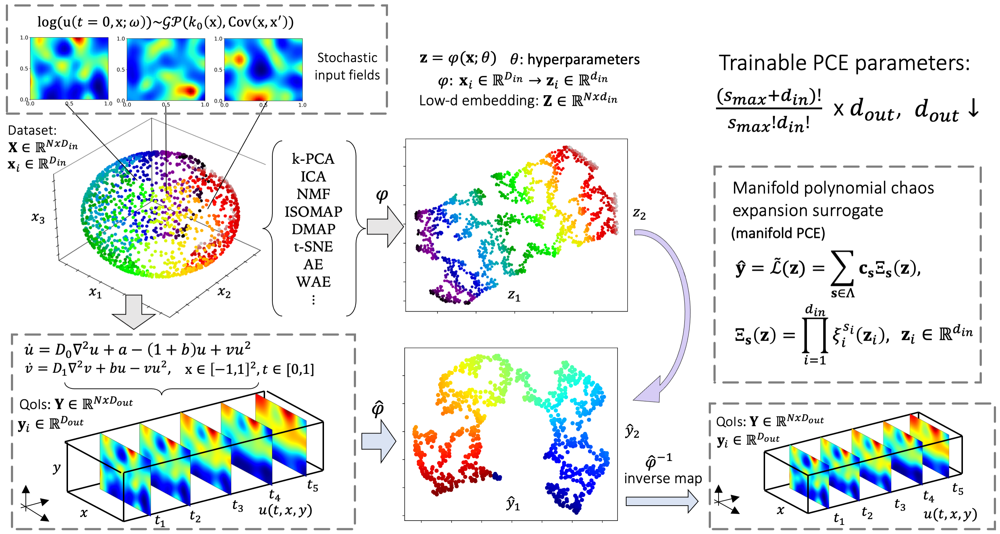
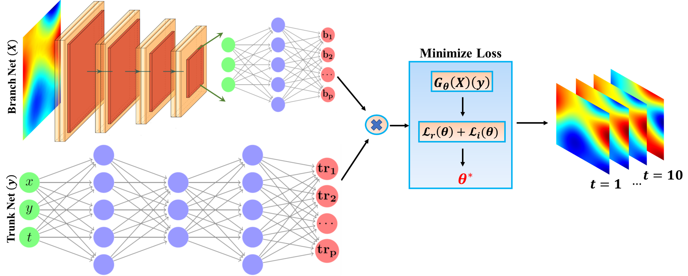
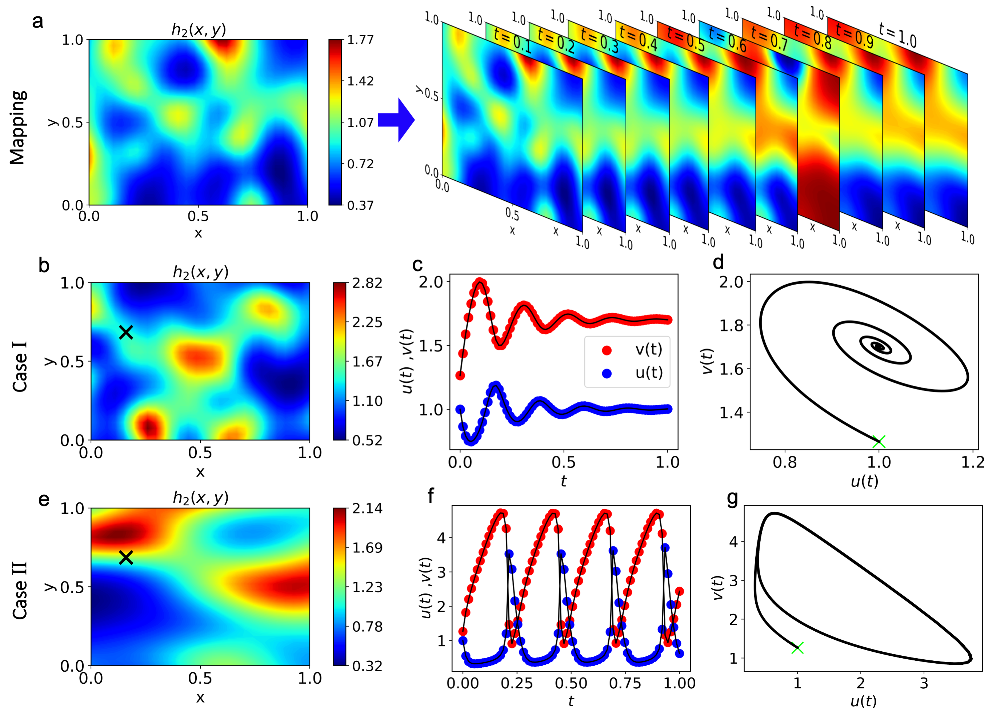

## Table of contents
* [General info](#general-info)
* [Methods](#methods)
* [Application](#application)
* [Contents](#contents)
* [Clone](#clone)

## General info

This Git repository contains codes for new developments and comparison of manifold-PCE and DeepONet.

## Methods

* _Manifold PCE_ or _mPCE_ approximates mappings via the identification of low-dimensional embeddings of input and output functions and the construction of a polynomial-based surrogate.

<p align="center">
  
</p>

* _DeepONet_ is a deep neural operator model which allows the construction of mapping between infinite dimensional functions via the use of deep neural networks (DNNs).

<p align="center">
  
</p>

## Application

The _Brusselator_ diffusion-reaction dynamical system is studied, which describes an autocatalytic chemical reaction between two substances. We explore the capabilities of the studied models and test them for various regression tasks including their extrapolation/generalization ability (perfor-
mance to out-of-distribution data), robustness to noise, ability to handle complex stochastic inputs and highly nonlinear mappings.

<p align="center">
  
</p>

## Contents

* _scripts_ - contains scripts used for implementing the surrogate modeling tasks

* _mPCE_ - contains notebook for constructing the mPCE model

## Clone

To clone and use this repository, run the following terminal commands.

```
git clone https://github.com/katiana22/mPCE-vs-DeepONet.git
cd mPCE-vs-DeepONet
pip install -r requirements.txt
```

## Citation

If you find this GitHub repository useful for your work, please consider citing this work:

```
ArXiv reference
```
______________________

### Contact
For more information or questions please contact us at:   
kontolati@jhu.edu   
somdatta_goswami@brown.edu
